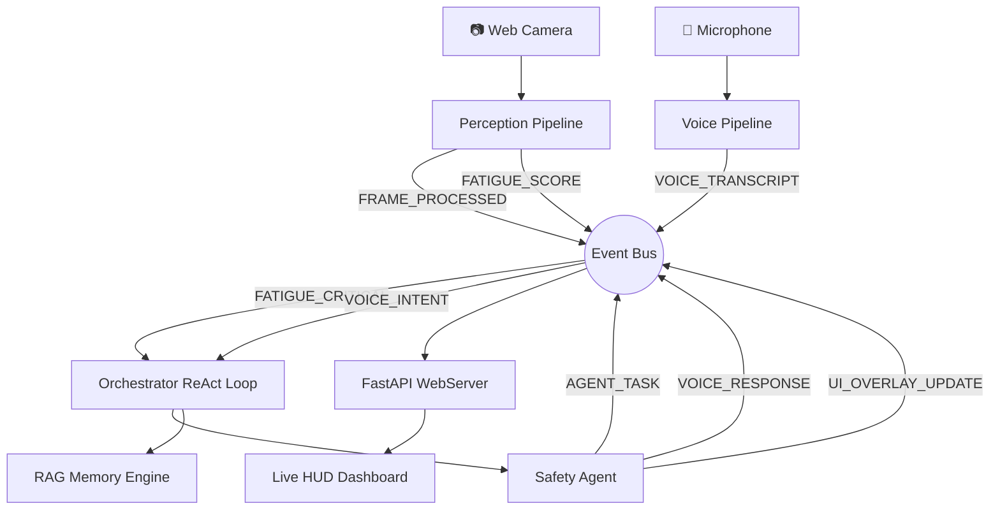

<div align="center">
  
# 🚗 DMS V5 SENTINEL
### The Ultimate Agentic Driver Monitoring Ecosystem

[](#)
[](#)
[](#)
[](#)
[](#)
[](#)

 **SYSTEM ONLINE** 

DMS V5 SENTINEL is a highly advanced, 100% offline **Event-Driven Agentic System**. It moves beyond reactive alerts to actively analyze driver fatigue, maintain unified episodic/semantic memory, assess traffic context, and orchestrate protective interventions using an asynchronous multi-agent ReAct loop.

</div>

---

## 🌟 Cinematic Dashboard & UI

DMS V5 replaces traditional local GUIs with a **Premium Glassmorphism Web Dashboard** served via ultra-low latency WebSockets.

*   **HUD Overlay:** Live camera stream rendered with Face Mesh bounding contours and real-time biometric stats directly painted on the frame.
*   **Voice Chat Terminal:** Real-time conversational interface with the Sentinel Voice Agent.
*   **LSTM Prediction Graphs:** Scrolling real-time charting forecasting fatigue 3 minutes into the future.
*   **Orchestrator Console:** Terminal-style window showing live ReAct steps, thoughts, and cognitive logic execution.

---

## 🧠 Core Architecture: Zero-Coupling Event Bus

At the heart of V5 is the **EventBus**—a highly concurrent publisher/subscriber engine that completely decouples perception, orchestration, and UI updates.



---

## 🔬 Elite 9-Signal Composite Fatigue Engine

The V5 perception engine utilizes MediaPipe's Task API and an adaptive Kalman Filter Bank (<0.5ms/frame) to smooth 478 3D landmarks in real-time, feeding a comprehensive fusion engine.

| Signal | Feature Description | Core Algorithm |
| :--- | :--- | :--- |
| **EAR / Blinks** | Eye Aspect Ratio + Blink Velocity | Soukupová & Čech + 1D Kalman |
| **PERCLOS** | Percentage of Eye Closure | Weighted rolling threshold |
| **Head Sway** | Nod frequency + sway oscillation | Head geometry pose vector variance |
| **MAR / Yawn** | 3D Mouth Aspect Ratio | Landmark Euclidean ratios |
| **Gaze Quality** | Attention heatmap + saccade speed | Iris tracking + saccade classification |
| **rPPG** | Heart rate & HRV-based stress | Forehead green-channel FFT |
| **Traffic Context**| Vehicle density & lane-change risk | YOLOv8 Scene Understanding |
| **LSTM Forecast**| 3-minute predictive fatigue trending | PyTorch LSTM |

---

## 💬 Traffic-Aware Voice Agent & RAG

The **Sentinel Voice Agent** continuously listens via **Silero VAD** gating and transcribes using **Faster-Whisper**. 

It provides context-aware interventions utilizing:
1.  **ChromaDB Vector Store:** Retrieves safety guidelines and past driver profiles via Semantic RAG.
2.  **Traffic Awareness:** Adjusts its tone and recommendations if it detects heavy traffic or lane-change risk via YOLOv8.
3.  **Local LLM (Ollama):** Classifies intentions and generates conversational responses entirely offline.

> **Driver:** *"I'm starting to feel quite tired."*  
> **Sentinel:** *"Noted. Your blink velocity has slowed down and your fatigue score is rising. Traffic is currently sparse. I recommend pulling over at the next exit for a rest."*

---

## 🛠️ Installation & Execution

### 📋 Prerequisites
*   macOS (M-Series optimized), Linux, or Windows.
*   **uv** (Ultra-fast Python package installer).
*   **Ollama** running locally for LLMs.

### ⚡ Setup & Run

```bash
# 1. Install dependencies extremely fast using uv
uv sync

# 2. Start the V5 Event-Driven Orchestrator & Web Server
uv run python main_v5.py
```

*Open `http://localhost:8000` in your browser to access the Sentinel Dashboard.*

---

## 📁 Project Structure

*   [`core/`](core/) — The async EventBus, event payloads (`models.py`), and system configuration.
*   [`perception/`](perception/) — MediaPipe FaceLandmarker, Kalman Filter Bank, rPPG, and LSTM Fatigue Engine.
*   [`detection/`](detection/) — YOLOv8 Traffic and Scene context analyzers.
*   [`agents/`](agents/) — ReAct `asyncio.PriorityQueue` loop, Safety escalation, and Coaching logic.
*   [`voice/`](voice/) — Silero VAD, Whisper STT, and Text-to-Speech integration.
*   [`memory/`](memory/) — Unified memory stack (Working buffer, Episodic SQLite, Semantic ChromaDB).
*   [`ui/web/`](ui/web/) — FastAPI WebSocket server and cinematic HTML/CSS/JS frontend.
*   [`rag/`](rag/) — Semantic search engine for driver history and safety manuals.

---
<div align="center">
  <i>Engineered for unparalleled safety, absolute privacy, and zero-latency autonomous interventions.</i>
</div>
